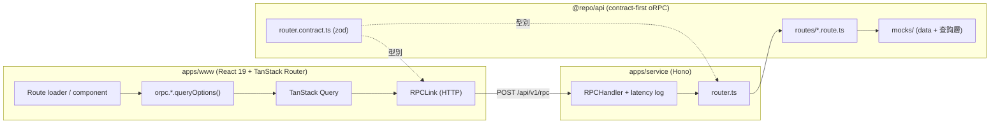

# momo demo — Mocking momoshop

純前端的 momo 電商網站 mock 實作（Take-home 題目 A）。所有商品、價格與活動皆為**虛構 mock data**，不串接任何真實 momo API。

本專案的重點不在功能完整度或 UI 精緻度，而在於 **系統設計、可維護性與工程判斷**：清晰的架構分層、型別安全的契約邊界、可演進的 mock 資料層，以及 Human-Agent 協作流程。

---

## 1. 架構總覽

沿用 monorepo 既有的 chiastack 慣例，資料流維持 `www → service → @repo/api`，差別只在於 router 後面接的是 **mock data** 而非真實後端：



單一 source of truth：**oRPC contract（zod schema）**。後端 handler 的輸入/輸出、前端 client 的型別，全部由 `router.contract.ts` 推導，UI 與後端不會 drift。

### 技術棧

| 範疇         | 技術                                                                              |
| ------------ | --------------------------------------------------------------------------------- |
| Monorepo     | pnpm workspace + Turborepo                                                        |
| API contract | oRPC (`@orpc/contract` / `server`) + zod 4                                        |
| 前端         | React 19、TanStack Router（file-based）、TanStack Query、HeroUI v3、Tailwind v4   |
| 狀態         | TanStack Query（server）、TanStack Router search params（URL）、Zustand（購物車） |
| 測試         | Vitest                                                                            |

---

## 2. 目錄結構（重點）

```
packages/api/src/orpc/
├── schemas/          # 可重用的 zod entity schema（單一資料定義來源）
│   ├── common.schema.ts   # 分頁、排序、促銷標籤
│   ├── product.schema.ts  # Product / ProductDetail
│   ├── category.schema.ts # 遞迴分類樹
│   ├── deal.schema.ts     # 限時秒殺
│   ├── home.schema.ts     # 首頁聚合 / banner / brand / 商品群組
│   ├── live.schema.ts
│   └── discover.schema.ts
├── mocks/            # mock data 與「查詢層」（搜尋 / 分頁 / 聚合）
│   ├── data/         # products / categories / brands / banners 原始資料
│   └── index.ts      # searchProducts / paginate / getHome / getActiveDeals ...
├── contracts/        # 每個 domain 的 oc.input/output 契約
├── routes/           # handler：呼叫 mocks 查詢層
├── router.contract.ts# 契約樹（型別來源）
└── router.ts         # 實作樹（掛載 handler）

apps/www/src/
├── routes/           # /  /search  /goods/$productId  /discover  /live
├── components/commerce/  # product-card / deal-card / banner / ranking / header ...
├── stores/cart.ts    # Zustand 購物車（persist localStorage）
├── hooks/use-countdown.ts
└── lib/api-types.ts  # 由 oRPC client 推導前端型別
```

---

## 3. API 介面

| Procedure            | 說明                                               | 對應畫面     |
| -------------------- | -------------------------------------------------- | ------------ |
| `catalog.home`       | 首頁聚合（banner / 旗艦品牌 / 秒殺 / 排行 / 新品） | `/`          |
| `catalog.search`     | 關鍵字 + 分類 + 排序 + 分頁                        | `/search`    |
| `catalog.getProduct` | 商品詳情（找不到回 `NOT_FOUND`）                   | `/goods/$id` |
| `category.list`      | 分類樹                                             | 搜尋頁篩選   |
| `deal.list`          | 限時秒殺（含到期時間 / 庫存進度）                  | 首頁         |
| `discover.feed`      | cursor 分頁的探索 feed                             | `/discover`  |
| `live.list`          | 直播列表 + 主打商品                                | `/live`      |

### Mock data 設計

- 商品標籤採「machine-readable `type` + 中文 `label`」雙欄位，UI 渲染原始 momo 文案（一日秒殺價 / 領券折 / 贈 mo 幣…），邏輯保持型別安全。
- 查詢層（`mocks/index.ts`）是**純函式**，與 oRPC 解耦，因此可單獨單元測試（見 `mocks/index.test.ts`）。
- 每個 handler 以 `@repo/utils/delay` 模擬網路延遲，讓前端確實走過 loading / skeleton 狀態。

---

## 4. 前端：狀態與渲染策略

- **Server state**：一律透過 `orpc.*.queryOptions()` 交給 TanStack Query；route `loader` 以 `queryClient.ensureQueryData` 預取，導頁即有資料、回訪走 cache。
- **URL state**：`/search` 的 keyword / categoryId / sort / page 全部存在 search params，並用 zod `validateSearch` 驗證 —— 可分享網址、可前進後退。
- **Client state**：購物車用 Zustand + `persist`，跨頁與重整保留。
- **Loading / Error**：skeleton 元件 + route 級 `errorComponent` / `notFoundComponent`。

---

## 5. 本地執行

需求：Node ≥ 22、pnpm、Bun（service 以 bun 執行）、Redis（service middleware 依賴，預設 `redis://localhost:6380`）。

```bash
pnpm install
pnpm db:up          # 起 Redis / Postgres（docker compose）
pnpm dev            # 同時啟動 www(:3000) 與 service(:3005)
```

- 前端：http://localhost:3000
- API（OpenAPI 形式，便於手動測試）：`POST http://localhost:3005/api/v1/rest/catalog/home`

### 測試 / 檢查

```bash
pnpm test           # Vitest（mock 查詢層單元測試）
pnpm type:check     # 全 workspace 型別檢查
pnpm lint           # oxlint
```

---

## 6. Tradeoff 與取捨

**優先完成（P0，核心架構 + 主畫面）**

- contract-first 的 mock API 分層（schema → mock → contract → route）
- 首頁 / 搜尋 / 商品詳情，以及共用 ProductCard 與站台 layout

**次要（P1，加值）**

- 限時秒殺倒數、探索無限捲動、直播頁、Zustand 購物車

**刻意不做（時間取捨）**

- 真實結帳 / 金流 / 會員登入：與「評估前端架構」目標關聯低
- i18n、SSR：增加複雜度但不影響架構展示
- 真實商品圖：以 `picsum.photos` placeholder 代替，聚焦資料結構而非素材

**關鍵設計決策**

- 維持既有 `www → service → @repo/api` 的 HTTP 管線，而非前端 in-process 呼叫：雖然多跑一個 service，但最貼合 repo 既有慣例，且更接近真實 production 拓撲，未來抽換成真後端只需改 handler。
- mock 查詢層做成純函式：讓「資料邏輯」可獨立測試、可被未來的真實 repository 取代（介面不變）。

---

## 7. Validation / Observability

- **Validation**：所有 procedure 的 input/output 都有 zod schema，請求進出邊界即驗證；錯誤（如查無商品）以 oRPC `ORPCError("NOT_FOUND")` 表達。
- **Observability**：`apps/service/src/routes/rpc.route.ts` 對每個 RPC 請求輸出結構化 latency log（method / path / status / durationMs / clientIP），即為未來接 metric / tracing 的掛載點。

---

## 8. Human-Agent 協作流程

本專案以 AI Agent 協作完成，流程刻意拆成可審查的階段：

1. **理解**：先讓 Agent 讀題目 PDF，並抓取真實 momoshop 頁面文字，萃取版面 DNA（秒殺 / 排行 / 旗艦館 / 商品卡欄位）。
2. **規劃（Plan mode）**：先產出架構與 Tradeoff plan，確認「維持現有 service 架構」「mock data 放 `@repo/api`」等關鍵決策後才動工。
3. **實作**：依 schema → mock → contract → route → 前端的順序推進，每完成一層即跑 `type:check` 收斂，最後以 curl 對 service 做 end-to-end smoke test。

> 維護者視角：契約（zod schema）是這個系統的核心資產。任何新功能都應「先改 contract，再讓型別推著前後端走」，而不是反過來。

---

## 9. 後續演進方向

- 將 `mocks/` 查詢層抽象為 `ProductRepository` 介面，正式後端只需提供同介面的實作即可替換。
- contract 加上 `.route({ method, path })` metadata，讓既有的 OpenAPI handler 產出正式 REST 文件。
- 搜尋導入 facet / 篩選聚合與 debounce（repo 已備有 `@tanstack/react-pacer`）。
- 以 MSW 在前端做契約層級的測試與 Storybook 化商品卡（呼應題目 B 的 Card Showroom 方向）。

```

```
